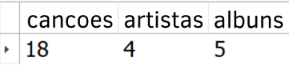
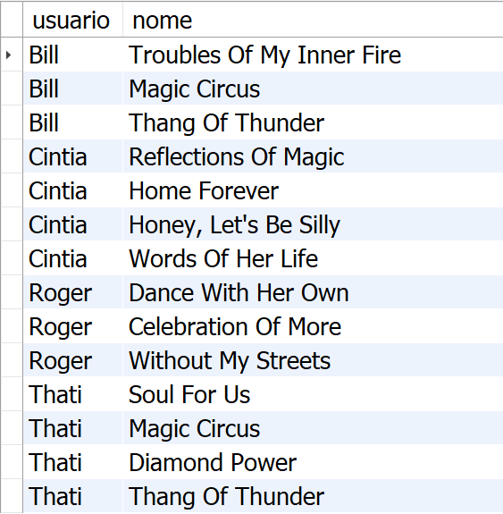
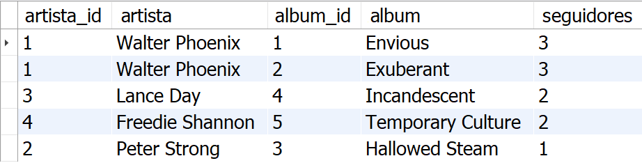
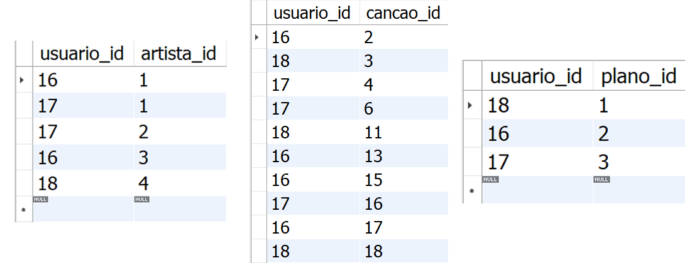
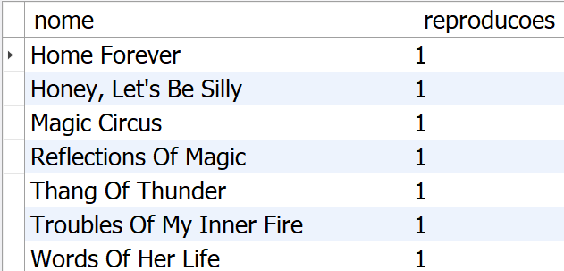

# Boas vindas ao repositório do projeto One For All!

## O que foi desenvolvido

O projeto ***One For All***, usará **uma** tabela para revisar e consolidar **todos** os principais conceitos vistos até o momento.

Foi recebido uma tabela não normalizada, a qual deverá ser normalizada e populada, para executar queries sobre ela com o intuito de encontrar as informações solicitadas.

---

## Problema a ser resolvido

Recebido a tabela não normalizada semelhante ao que poderia ser uma versão simplificada do banco de dados do Spotify. O trabalho consistirá de duas partes:

1. Normalizar essa tabela, criar o schema no seu banco de dados local e populá-lo;

2. Realizar os desafios no seu banco normalizado e populado.

**Aviso:** Todos os dados da tabela abaixo são fictícios e foram gerados aleatoriamente através de ferramentas, com o intuito deixar o projeto mais real. Quaisquer similaridades com informações reais são meras coincidências.

**Observação:** O banco de dados real do Spotify é muito mais completo que a tabela abaixo. No entanto, foi utilizado as informações passadas e solicitadas aqui. Não crie dados que não foram solicitados.

#### Normalize as tabelas para a 3ª Forma Normal

Abaixo você pode visualizar e baixar uma planilha com as tabelas que deverão ser normalizadas:

[Faça o download dela aqui](./SpotifyClone-Non-NormalizedTable.xlsx)

Antes de tudo, você deverá normalizar essas tabelas para a 3° Forma Normal. Monte quantas planilhas e tabelas forem necessárias para criar essa versão normalizada. Não é necessário criar o código SQL neste momento.

Embora não seja necessário, é recomendado que você crie suas planilhas na sequência 1ª -> 2ª -> 3ª Forma Normal.

Deve ser possível encontrar as informações abaixo em suas tabelas:

* Informações sobre quais planos estão disponíveis e seus detalhes;

* Informações sobre todos os artistas e seus detalhes (use informação abaixo);

* Informações sobre todos os álbuns de cada artista (use informação abaixo);

* Informações sobre todas as canções de cada álbum (use informação abaixo);

* Informações sobre planos que um usuário ou uma usuária possui;

* A relação que cada usuário ou usuária possui com um plano;

* A relação que cada artista possui com um álbum;

* A relação que cada canção possui com um álbum;

* A relação de quais artistas um usuário ou uma usuária está seguindo;

* A relação de todas as canções reproduzidas por um usuário ou uma usuária.

Após ter deixado as tabelas na 3ª Forma Normal, faça quaisquer modificações que forem necessárias em suas tabelas para que elas possam ser capazes de armazenar as informações descritas abaixo:

* Artista "***Walter Phoenix***" criou o álbum "***Envious***" com as canções *"Soul For Us"*,*"Reflections Of Magic"* e *"Dance With Her Own"*;

* Artista "***Walter Phoenix***" criou o álbum "***Exuberant***" com as canções *"Troubles Of My Inner Fire"* e *"Time Fireworks"*;

* Artista "***Peter Strong***" criou o álbum "***Hallowed Steam***" com as canções *"Magic Circus"*, *"Honey, So Do I"*,*"Sweetie, Let's Go Wild"* e *"She Knows"*;

* Artista "***Lance Day***" crio o álbum "***Incandescent***" com as canções *"Fantasy For Me"*, *"Celebration Of More"*, *"Rock His Everything"*, *"Home Forever"*, *"Diamond Power"* e *"Honey,Let's Be Silly"*;

* Artista "***Freedie Shannon***" criou o álbum "***Temporary Culture***" com as canções *"Thang Of Thunder"*, *"Words Of Her Life"* e *"Without My Streets"*.

Caso sua estrutura ainda não atenda a esses requisitos, volte à estrutura que foi criada no passo anterior e faça as alterações necessárias para que suas tabelas possuam essas informações.

---

## Desafios SQL

##### Desafio 1 - Transforme Suas planilhas em Código SQL

Seu desafio agora é pegar toda a estrutura que você criou na seção anterior e transformá-la em código SQL. Os detalhes estão a seguir:

* Crie um banco com o nome de **`SpotifyClone`**;

* Providencie as queries necessárias para criar tabelas normalizadas que atendam aos requisitos descritos na seção anterior;

* Providencie as queries necessárias para popular as tabelas de acordo com os dados listados na seção anterior.

Crie somente um arquivo `SQL`.

##### Desafio 2

Crie uma `VIEW` chamada `estatisticas_musicais` que exiba três colunas. Cada coluna da `VIEW` deve exibir quantas vezes algo está cadastrado no banco de dados. Exiba a quantidade de canções na primeira coluna e dê a essa coluna o apelido "**cancoes**". A segunda coluna deve exibir a quantidade de artistas, e deverá ter o apelido "**artistas**". A terceira coluna deve exibir a quantidade de álbuns, e deverá ter o apelido "**albuns**".

Sua `VIEW` deve retornar a seguinte informação ao ser consultada:

---

##### Desafio 3

Crie uma `VIEW` chamada `historico_reproducao_usuarios`. Essa `VIEW` deverá ter apenas duas colunas. A primeira coluna deve ser apelidada de "**usuario**" e deve exibir o nome do usuário ou da usuária. A segunda coluna deve ser apelidada de "**nome**" e exibir o nome da canção ouvida por aquele usuário ou usuária com base no seu seu histórico de reprodução. Os resultados devem estar ordenados por nome de usuário ou usuária em ordem crescente.

Sua `VIEW` deve retornar a seguinte informação, ao ser consultada:

---

##### Desafio 4

Crie uma `VIEW` com o nome `top_3_artistas` que exiba o código identificador, o nome e a quantidade de pessoas que segue este artista. Sua `VIEW` deve mostrar somente os três artistas mais populares no banco `SpotifyClone`.

A coluna que representa o código identificador do artista deve ser apelidada de "**artista_id**". A coluna que contém o nome do artista deve ser apelidada de "**artista**". A coluna com a quantidade de pessoas que estão seguindo aquele artista deve receber o apelido "**seguidores**".

Seu resultado deve estar ordenado em ordem decrescente, baseando-se na quantidade de seguidores.

Sua `VIEW` deve retornar a seguinte informação, ao ser consultada:

---

##### Desafio 5

Estamos fazendo um estudo das músicas mais tocadas e precisamos saber quais são as duas músicas mais tocadas no momento. Crie uma `VIEW` chamada `top_2_hits_do_momento` que deve exibir as informações sobre o nome da canção e quantas vezes ela foi tocada recentemente (considere todas canções registradas no banco como "recentemente"). Dê à coluna que possui o nome da canção o apelido "**cancao**" e a que possui a quantidade de vezes que foi tocada o apelido "**reproducoes**".

Seu resultado deve estar ordenado em ordem decrescente, baseando-se no número de reproduções. Queremos apenas o top 2 de músicas mais tocadas.

Sua `VIEW` deve retornar a seguinte informação, ao ser consultada:

---

##### Desafio 6

Queremos algumas informações sobre o faturamento da empresa. Tenha como base o valor dos planos e o plano que cada usuário ou usuária cadastrado possui no banco. Crie uma `VIEW` chamada `faturamento_atual` que deve exibir quatro dados. A primeira coluna deve exibir o mínimo faturado com planos da Spotify, com o apelido de "**faturamento_minimo**". A segunda coluna deve exibir o valor máximo faturado, com o apelido de "**faturamento_maximo**". A terceira coluna deve exibir o valor médio faturado até o momento, com o apelido de "**faturamento_medio**". Por fim, a quarta coluna deve exibir o faturamento total, com o apelido de "**faturamento_total**".

Sua `VIEW` deve retornar a seguinte informação, ao ser consultada:

---

##### Desafio 7

Mostre uma relação de todos os álbuns produzidos por cada artista, juntamente com a quantidade de seguidores que aquele artista possui, de acordo com os detalhes a seguir. Crie uma `VIEW` chamada `perfil_artistas` que, na primeira coluna, deve exibir a valor identificador do artista, com o apelido "**artista_id**". A segunda coluna deve exibir o nome do artista, com o apelido "**artista**". A terceira coluna deve exibir o valor identificador do álbum, com o apelido "**album_id**". A quarta coluna deve exibir o nome do álbum, com o apelido "**album**". A quinta coluna deve exibir a quantidade de seguidores que aquele artista possui e deve ser apelidada de "**seguidores**". 

Seus resultados devem estar ordenados em ordem decrescente, baseando-se no número de seguidores.

Sua `VIEW` deve retornar a seguinte informação, ao ser consultada:

---

##### Desafio 8

Crie uma trigger chamada `trigger_usuario_delete` que deve ser disparada sempre que um usuário ou uma usuária for excluído(a) do banco de dados. Sua trigger deve executar a seguintes ações abaixo, em ordem:

1. Remover informações sobre este usuário ou esta usuária da tabela que armazena quem ele ou ela estava seguindo;

2. Remover informações sobre este usuário ou esta usuária do histórico de reprodução;

3. Remover informações sobre este usuário ou esta usuária da tabela que mostra a relação do usuário com seu plano.

Teste a funcionalidade correta de sua trigger, fazendo a exclusão da usuária 15.

Sua trigger deve acarretar a exclusão do usuário ou da usuária que for passado(a) em todas as tabelas mencionadas acima. Em consequência disso, todas referências devem ser excluídas, como na imagem abaixo:

---

##### Desafio 9

Crie uma procedure chamada `albuns_do_artista` que recebe como parâmetro o valor da coluna identificadora de um artista e em retorno deve exibir as seguintes quatro colunas: o código identificador do artista, com o apelido "**artista_id**", o nome do artista, com o apelido "**artista**", o valor identificador do álbum produzido por aquele artista, com o apelido "**album_id**" e o nome do álbum, com o apelido "**album**".

Confirme a execução correta da procedure, chamando-a e passando o valor "1" como parâmetro. Sua procedure deve retornar o mesmo que o resultado abaixo:

`CALL albuns_do_artista(1)`

---

##### Desafio 10

Crie uma function chamada de `quantidade_musicas_no_historico` que exibe a quantidade de músicas que estão presente atualmente no histórico de reprodução de um usuário ou uma usuária. Ao receber o código identificador daquele usuário ou daquela usuária, exiba a quantidade de canções em seu histórico de reprodução.

Sua procedure deve retornar o mesmo resultado da imagem ao receber o valor "17" como parâmetro:

---

##### Desafio 11

Crie uma `VIEW` chamada "*CancoesPremium*" que exiba o nome e a quantidade de vezes que cada canção foi tocada por usuários e usuárias do plano familiar ou universitário, de acordo com os detalhes a seguir.

A primeira coluna deve exibir o nome da canção, com o apelido "**nome**". A segunda coluna deve exibir a quantidade de reproduções que aquela canção recebeu, com o apelido "**reproducoes**".

Seus resultados devem agrupar as canções através de seu nome e devem estar ordenados por nome da canção em ordem crescente.

Sua `VIEW` deve retornar a seguinte informação, ao ser consultada:

---
